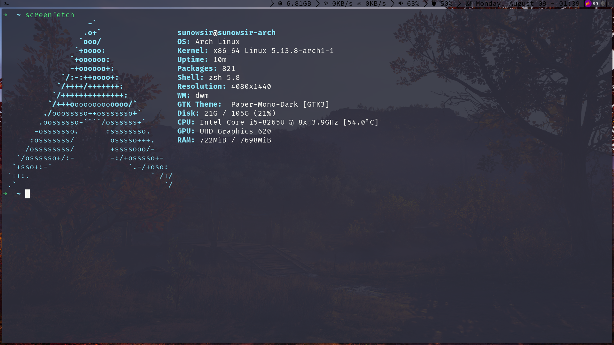

# config
> My desktop environment configuration

* path : `~/.config`
* description: 
    * `autostart.dwm`: dwm start script.
* my install: 
    * `nvim` (about nvim config, go to my vim config.)
    * `fcitx5`
    * `picom-ibhagwan-git`
    * `unzip`
    * `xclip`
    * `ctags`
    * `patch`
    * `acpi`
    * `amixer`
    * `alsa`
    * `alsa-utils`
    * `acpitool`
    * `wpa_supplicant`
    * `networkmanager`
    * `netwrok-manager-applet`
    * `nm-connection-editor`
    * `nerd-fonts-complete`
    * `flameshot`
    * `libxft-bgra`
    * `tlp`
    * `bluez`
    * `bluez-utils`
    * `bluez-utils-compat`
    * `blueman`
    * `pulseaudio`
    * `pulseaudio-bluetooth`
    * `acpilight` (need: `sudo gpasswd video -a 用户名`)
    * `dunst`
    * `ntfs-3g`
    * `atool`
    * `highlight`
    * `poppler`
    * `mediainfo`
    * `ffmpegthumbnailer`
    * `fontforge`
    * `transmission-cli`
    * `exfat-utils`
    * `rofi`

* Screenshots
    

* todo 
    - [ ] 状态栏刷新残留
    - [x] 无窗口的时候执行切换聚焦快捷键 `dwm` 崩溃
    - [ ] `systray` 违和（包括颜色与状态栏不匹配以及偶尔不透明）
